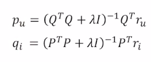

# Model Based Collaborative Filtering (MBCF)

+ NBCF의 한계
	+ Sparsity (희소성) 문제 -> Cold start : 데이터 부족, 없는 유저는 추천 불가능
	+ Scalability (확장성) 문제

이를 해결 하기 위한 MBCF

-> 데이터에 숨겨진 유저-아이템 관계의 잠재적 특성/패턴을 찾음

-> 유저, 아이템 벡터가 모두 학습을 통해 변하는 파라미터

-> MF factorization으로 현업에서는 쓰이고 있음

## MBCF 장점(vs. NBCF)
1) 모델 학습 / 서빙
2) Sparsity / Scalability 개선
3) Overfitting 방지
4) Limited Coverage 극복

## Feedback
+ Explicit feedback
유저의 선호도를 직접적으로 알 수 있는 데이터 (좋아요, 평점)

-> 점수로도 가능

+ Implicit feedback
유저의 선호도를 간접적으로 알 수 있는 데이터 (클릭, 방문)

-> 선호 여부만 가능

## Latent Factor model
: 유저와 아이템의 관계를 잠재적 요인으로 표현할 수 있다고 보는 모델

유저- 아이템 행렬을 저차원 행렬로 분해하는 방식으로 작동

ex)

# Singular Value Decomposition
-> 선형대수학에서 차원 축소 기법 중 하나

한계점
+ decomposition 하려는 행렬의 정보가 불완전할 때 정의되지 않음
+ 결측된 entry를 모두 채우는 Imputation(0 or 유저/아이템 평균)을 통해 dense matrix 만듬
+ 정확하지 않은 imputation -> 데이터 왜곡

# Matrix Factorization (MF)
user-item 행렬을 저차원의 user와 item의 latent factor 행렬의 곱으로 분해하는 방법

U : user data
I : item data
k : latent 

정규화 : weight 가 너무 커지지 않도록, overfitting 방지도 같이

(MF 에서는 L2 정규화 사용)

## MF 학습
-> SGD 사용

## MF + $\alpha$
(from matrix factorization techniques for recommender systems)

 + Adding Bias

전체 평균, 유저/아이템의 bias 추가하여 예측 성능을 높임

+ Adding Confidence level

모든 평점이 동일한 신뢰도를 갖지 않음. $r_{u,i}$ 에 대한 신뢰도를 의미하는 $c_{u,i}$ 추가

+ Adding Temporal Dynamics
시간에 따라 변화하는 유저, 아이템의 특성 반영

# MF for Implicit feedback
(from collaborative filtering for implicit feedback datasets)

## ALS
: Alternative Least Square

: 유저(P)와 아이템(Q) 매트릭스를 번갈아가면서 업데이트

(한쪽은 상수로 고정하고 한쪽 업데이트 하는 방식) (least-square 문제 )

-> 병렬처리 가능하여 SGD 보다 빠른 학습 가능

목적함수 : 

아래 수식을 이용해 번갈아 가면서 업데이트

## MF for Implicit feedback

rating
+ Preference
유저 u 가 아이템 i 를 선호하는지 여부

+ Confidence
유저 u 가 아이템 i 를 선호하는 정도 (increasing function)

$\alpha$ 는 positive feedback 과 negative feedback 간의 상대적 중요도를 조정하는 하이퍼 파라미터

(adding confidence level 참고)

# Bayesian Personalized Ranking(BPR)
+ Personalized Ranking : 사용자에게 ranking이 있는 아이템 리스트를 제공하는 문제 ( = 아이템 추천 문제)

+ Personalized Ranking 을 반영한 최적화(학습)

유저의 아이템에 대한 선호도 랭킹을 생성하여 이를 MF 학습 데이터로 사용

+ 가정
	+ 관측된 아이템을 관측되지 않은 아이템보다 선호
	+ 관측된 아이템끼리는 선호도를 추론할 수 없음
	+ 관측되지 않은 아이템끼리도 선호도를 추론할 수 없음
+ 특징
	+ 관측되지 않은 아이템에 대해서도 정보를 부여하여 학습 / ranking 가능

## MAP(maximum a posterior)
: 최대 사후 확률 추정

posterior 최대화 : 유저 선호정보 최대한 잘 나타내는 parameter 만드는 것

 

