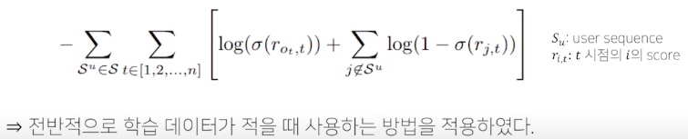

# 할 일

- 시퀀셜 모델
- 미션 4
- 한자공부
- 저녁 영화

# 6강 - Temporal & Sequential models

- Autoregression
	: 회귀 분석의 관점에서 과거의 데이터를 보고 현재 또는 미래의 결과를 예측하는 모델 (자귀 회귀라고 번역함)
	
	이를 위해 Temporal dynamics를 고려하고 시계열 정보를 사용함
	
	MSE를 사용하여 과거데이터를 통한 미래 예측
	
	autoregression에도 여러 방법이 있음
	
	- Moving average(이동평균)
		최근 K 개의 평균을 예측에 사용
		
	- Weighted Moving average
		최근값에 비중을 더 크게 주도록 weight를 미리 정하고 학습
		
		변동에 훨씬 민감하고 실제 값에 더 가깝게 regression 됨
		
	- learning-based Moving average
		weight를 미리 정하지 않고 학습하는 방법 

## 2. Temporal Recommendations

### 2.1 Long term Dynamics

- Time Weight Collaborative Filtering (Ding and Li)
	1) 서로 비슷한 아이템의 평점은 유사할 것이다
	   
	2) 평점을 매긴 시간이 멀어질수록 유사도의 반영 정도를 줄여아 한다

### 2.2 short term dynamics

session : 사용자가 의도를 가지고 검색하거나 클릭한 행위

-> session을 이용해서 사용자의 의도를 파악하자!

## 3. Sequential Recommendations

- Markov property
	다음 상태는 그 직전의 상태에만 영향을 받음
	
	
	
	이를 이용한 사례가 Markov Chain
	
	

- FPMC (Factorized Personalized Markov Chains) 
	유저 정보와 직전의 소비한 item을 통해 다음 Item 예측

- Personalized Ranknig Metric embedding
	유클리안 거리를 이용하여 sequential compatibility 표현

- FME (Factorized Markov Embedding)
	
	
	
	item 간에는 distance metric
	
	user-item 간에는 inner product  

- Translation-based Rec
	item 을 embedding space 상의 point로 표현, user의 translation vector에 의해서 Item sequence를 예측

# 7강 딥러닝 + 시퀀셜

Markov는 모든 user기록을 반영할수 없음

-> 시퀀셜 모델 사용하면 가능

## 7.1 RNN sequential 

NLP에서의 discrete token(word, character) 를 item으로 변환하면 Rec에서 사용가능

- GRU4Rec
	user term을 사용하는 대신 interaction을 session으로 나누어 NLP 문장 처럼 다룸
	
	Input : item / output:  최종 item의 예측
	
	Negative sampling은 Mini batch 내의 항목만 적용하여 계산
	
	
	
	Loss 함수 : BPR, TOP1 Loss 사용 (Top-k ranking )

- Neural Attentive Rec machine
	 User 의 취향을 global, local 두 레벨로 나눠서 분석
	
	
	
	global은 GRU 마지막 hidden step 만을 사용
	
	local은 모든 hidden step을 가중치를 적용하여 사용
	
	두 인코더를 통해 최종 임베딩 생성
	

## 7.2 Transformer Rec

- SASRec (Self- Attentive Sequential Rec)
	- transformer 와의 차이점
		1) Dropout 사용하여 overfitting 방지
		
		2) Shared item embedding : Input embedding 과 output 예측을 위한 parameter를 동기화
		   
		3. Training Loss : Negative sample을 이용한 BCE 사용
		
		 

- BERT4Rec
	양방향으로 (과거와 미래) self attention 적용하는 Bert 적용
	
	Cloze task : 일부 token 을 가린후 복원  (masked language Model 과 같은 역할 수행)

## 7.3 Side information using Rec
- self supervised learning : raw data로부터 representation 학습하는 방법론
		다양한 관점에서 데이타를 바라보면서 다양한 패턴을 찾아낼 수 있음

- S3 Rec (Self-Supervised Learning for Sequential Recommendation with mutual information maximization)
	
	총 4개의 auxiliary loss들을 활용하여 item-attribute, sequence item, sequence attribute, sequence sequence 관계를 모델링함
	
	Loss 함수 :  pair wise ranking loss 사용
	
	학습한 item의 representation
	
	self attention의 마지막 블록의 아웃풋의 inner product 

# 오피스 아워

가정을 하면서 실험을 하는 것을 추천

내가 가지고 있는 생각들을 하이퍼 파라미터로 실험해 보면서 입증해보자

그냥 그렇구나 하는 것보다 훨씬 좋은 실험 결과를 얻어갈 수 있을 것이다.

비슷한 말이지만 공부를 하면서도 개선해야 할 점 무엇일지 적으면서 해보자

ex) negative sampling 하는 방법, 모델 구조 어떤식으로 개선 시킬 수 있을까